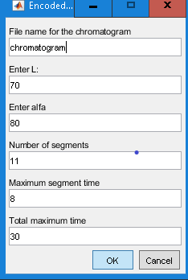

**Description**

MEG (multisegmented elution gradient) tool builds and graphically
displays the binary or ternary gradient desired by the researcher.

There are two ways of entering the data: encoded and manual.

Encoded mode requires two parameters to establish the composition of
mixture: L and α.

-   L, defines the binary mixture whose composition is the beginning of
    the mobile phase gradient profile. L takes values ​​between 0 and
    200, where L = 0 is 100% methanol, L = 100 is 100% water and L = 200
    is 100% acetonitrile.

-   α is the angle formed by the line defining the gradient profile and
    the horizontal depicted from L. α can take values ​​between 0 and 120
    °, coinciding 0 ° with the horizontal and 120° with the side of the
    triangle. Note that when L ∈ (0, 100), α is oriented clockwise,
    while when L ∈ (100, 200) it is oriented counterclockwise.

Three parameters are required to define the chromatographic gradient
profile

-   Number of segments: An integer between 1 and 11.

-   Maximum segment time: The maximum minutes that the composition of
    the mobile phase will be maintained in each segment.

-   Total maximum time: The total time, in minutes, of the gradient.

In the manual mode, the inputs for MEG are:

-   The initial composition of the mobile phase

-   The final composition of the mobile phase

-   The time (in minutes) that the composition of the mobile phase
    remains in each segment of the gradient.

To start working with the tool, download the source files from this
[repository](https://github.com/lsarabiapeinador/MEG) and manually add
the tool's folder to the MATLAB Path. Launch the tool by executing the
comand 'MEG' in Matlab console. Choose between one of two options:
'Encoded' or 'Manual' (Fig. 1)

  -----------------------------------------------------------------------
  
  -----------------------------------------------------------------------
  **Fig 1**. Startup window

  -----------------------------------------------------------------------

The Encoded button opens an input dialog where one can create a
multisegmented gradient elution (Fig. 2) using the parameters previously
described.

  -----------------------------------------------------------------------
  
  -----------------------------------------------------------------------
  **Fig 2**. Data tab. Create a new elution gradient multisegmented

  -----------------------------------------------------------------------

Select the parameters and press the "OK" button. Then, composition of
mobile phase and the temporal profile are displayed (Fig. 3). A folder
with the user selected name (Fig. 2) is created containing the two
figures, the parameters and introduced values (in a mat file) (Fig. 4).

  -----------------------------------------------------------------------
  
  -----------------------------------------------------------------------
  **Fig 3**. Graphical description of the chromatographic profile

  -----------------------------------------------------------------------

  ----------------------------------------------------------------------------------------------------------------------------------------------
     			      |    automáticamente](./img/media/image5.png)                                      
  ---------------------------------------------------------------------- -----------------------------------------------------------------------
  **Fig 4**. Tabular description of the chromatographic profile          

  ----------------------------------------------------------------------------------------------------------------------------------------------

The Manual button opens an input dialog (Fig. 5) where a multisegmented
gradient elution can be created using the initial and final composition
of mobile phase and the times that the composition of the mobile phase
remains in each segment of the gradient.

  -----------------------------------------------------------------------
  
  -----------------------------------------------------------------------
  **Fig 5**. Data tab. Create manually a new elution gradient
  multisegmented

  -----------------------------------------------------------------------

After selecting the parameters and pressing the "OK" button. The
composition of mobile phase and the temporal profile are displayed
graphically and saved in a folder as it is shown in figures 6 and 7.

  -----------------------------------------------------------------------
  
  -----------------------------------------------------------------------
  **Fig 6**. Graphical description of the manual chromatographic profile

  -----------------------------------------------------------------------

  ----------------------------------------------------------------------------------------------------------------------------------------------
  				|   automáticamente](./img/media/image9.png)
  ----------------------------------------------------------------------- ----------------------------------------------------------------------
  **Fig 7**. Tabular description of the manual chromatographic profile    

  ----------------------------------------------------------------------------------------------------------------------------------------------

**Auxiliary functions:**

-   grafgrad(chromatogram). Read the table containing the
    \'chromatogram.mat\' file generated by MEG tool and draw the
    gradient composition

-   grafprofile(chromatogram). Read the table containing the
    \'chromatogram.mat\' file generated by MEG tool and draw the
    gradient time profile

-   tmixture. Has no inputs, draws the triangle of mixtures without any
    other graphic object.

**Cite as**
 
L.A. Sarabia, M.M. Arce, D. Castro, S. Sanllorente, M.C.Ortiz. 
“MEG a MATLAB tool to build a multisegmented ternary gradient profile."

